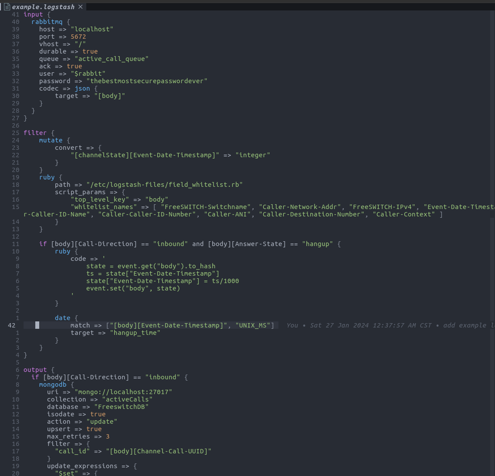

# Tree Sitter Logstash

This is an implementation of the treetop logstash grammar for tree-sitter.

## Notes

- There are differences between treetop and tree-sitter. I have done my best to match tree top, however deviations may exist
- This is good enough for syntax highlighting, I am working on using this as a config validator
- nvim-treesitter expects a unqiue-ish filename, so unlike the logstash standard, this project expects logstash pipelines to have the .logastash file extension

## Example

What highlighting of `tests/example.logstash` looks like



## Neovim

`nvim-treesitter` has great [instructions](https://github.com/nvim-treesitter/nvim-treesitter?tab=readme-ov-file#adding-parsers). Below is a walkthrough of their intrsuctions, but focused on tree-sitter-logstash

First clone the repo into a directory that can be referenced by neovim

```bash
mkdir -p ~/some/path
cd ~/some/path
git clone https://git.preston-baxter.com/Preston_PLB/tree-sitter-logstash.git
```

Add this to wherever you configure your nvim. I would recomend placing this where you load `nvim-treesitter`. In your lazy config for example.
Creating a file in the `after/` direcrtory is also fine.

```lua
    local parser_config = require "nvim-treesitter.parsers".get_parser_configs()
    parser_config.logstash = {
      install_info = {
        url = "~/some/path/tree-sitter-logstash",
        files = {"src/parser.c"}, -- note that some parsers also require src/scanner.c or src/scanner.cc
        branch = "master",
      },
    }

    vim.filetype.add({
        extension = {
            logstash = "logstash"
        }
    })
    vim.treesitter.language.register("logstash", "logstash")
```

The block above tells nvim-treesitter where to find the logstash parser, defines the logstash file type, and registers that filetype to a treesitter parser


In vim now run
```
:TSInstall logstash
```

This will load the logstash parser into neovim. Now you need to link the syntax highlighting file to a place where neovim can find it.(See [this](https://github.com/nvim-treesitter/nvim-treesitter?tab=readme-ov-file#adding-parsers) for why)

```
mkdir -p ~/.config/nvim/queries/logstash
ln -s ~/some/path/queries/highlights.scm ~/.config/nvim/queries/logstash/highlights.scm
```

`~/.config/nvim/queries/logstash/` can be replaced with any `queries/logstash` path in a nvim runtime directory


Now that all that is done. Load up neovim and open a logstash file
